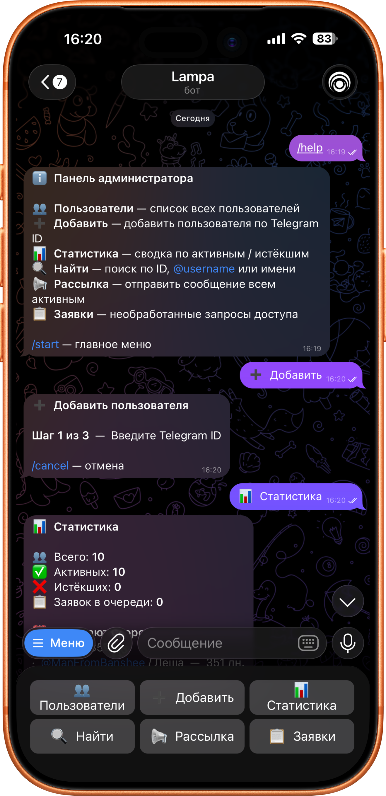

<div align="center">

# 🤖 TelegramBot

**Динамический модуль управления доступом для медиасервера Lampac**

[](LICENSE)
[](https://github.com/lampac-nextgen/lampac)
[](https://dotnet.microsoft.com)
[](https://t.me/BotFather)

Добавляет Telegram-бота, который управляет пользователями Lampac: принимает заявки, одобряет/отклоняет доступ, продлевает и блокирует аккаунты, рассылает сообщения и уведомляет об истечении срока.



</div>

---

## ✨ Возможности

<details>
<summary><b>👤 Для пользователей</b></summary>

<br>

- `/start` — приветствие с описанием сервиса и кнопкой запроса доступа
- `/help` — справка по командам и кнопкам
- **Профиль** — статус, дата истечения, оставшиеся дни, ID для подключения (случайный 9-значный токен)
- **🔄 Обновить ID** — генерирует новый токен прямо из профиля (старый сразу перестаёт работать)
- Кнопка продления при истёкшем доступе
- **Поддержка** — пользователь пишет произвольный текст → сообщение доставляется администратору с кнопкой «Ответить»

> [!TIP]
> **Как использовать ID для входа:** после одобрения заявки бот присылает сообщение с `🔑 ID для подключения` — 9-значное число. Его же можно посмотреть в «📋 Мой профиль». Это число нужно вставить в поле **Пароль** при подключении к Lampac. Telegram ID пользователя паролем не является.

</details>

<details>
<summary><b>🛠️ Для администратора</b></summary>

<br>

| Кнопка | Что делает |
| --- | --- |
| 👥 Пользователи | Листаемый список всех пользователей |
| ➕ Добавить | Трёхшаговый мастер добавления пользователя по Telegram ID |
| 📊 Статистика | Всего / активных / истёкших / заявок в очереди |
| 🔍 Найти | Поиск по Telegram ID, @username или части имени |
| 📢 Рассылка | Сообщение всем активным пользователям с предпросмотром |
| 📋 Заявки | Список необработанных заявок с кнопками одобрения |

**Карточка пользователя:** блокировка / разблокировка, изменение даты истечения, удаление с подтверждением.

</details>

<details>
<summary><b>🔒 Защита и безопасность</b></summary>

<br>

- **Rate limiting** — не более одного запроса доступа в 5 минут на пользователя
- **Подтверждение удаления** — кнопка «Удалить» требует второго нажатия для подтверждения
- **Аудит-лог** — все действия (одобрение, отказ, блокировка, удаление, регенерация токена) записываются в `audit.log`

</details>

<details>
<summary><b>⏰ Фоновые задачи</b></summary>

<br>

**Ежедневные уведомления** — таймер срабатывает каждый час, но реально рассылает не чаще одного раза в сутки (дата последней отправки хранится в `notifications_date.txt`). Находит пользователей с ≤ 7 днями остатка, пишет каждому из них и отправляет сводку администратору.

</details>

---

## 🚀 Установка

### Требования

- [Lampac](https://github.com/lampac-nextgen/lampac) — хост компилирует и загружает модули динамически
- Telegram-бот, созданный через [@BotFather](https://t.me/BotFather)
- Ваш Telegram ID (можно узнать у [@userinfobot](https://t.me/userinfobot))

---

### Шаг 1 — Скопируйте файлы модуля

Поместите содержимое репозитория в папку пользовательских модулей Lampac (`mods/` — рядом с `Core.dll`):

```text
lampac/
└── mods/
    └── TelegramBot/
        ├── manifest.json
        ├── modInit.cs
        ├── models/
        │   ├── lampacUser.cs
        │   └── telegramBotConf.cs
        ├── services/
        │   ├── auditlog.cs
        │   ├── botsession.cs
        │   ├── pendingrepo.cs
        │   ├── telegrambothostedservice.cs
        │   └── usersrepository.cs
        └── references/
            └── Telegram.Bot.dll
```

---

### Шаг 2 — Добавьте секцию в `init.conf`

```ini
[TelegramBot]
enable=true
bot_token=1234567890:AAF...
admin_id=123456789
users_file_path=users.json
default_expire_days=365
```

| Ключ | Описание |
| --- | --- |
| `enable` | `true` / `false` |
| `bot_token` | Токен от BotFather |
| `admin_id` | Telegram ID единственного администратора |
| `users_file_path` | Путь к файлу хранилища пользователей (по умолчанию `users.json`) |
| `default_expire_days` | Дней доступа при одобрении / разблокировке (по умолчанию `365`) |

> [!WARNING]
> `bot_token` — секрет. Не публикуйте `init.conf` в открытом репозитории и не передавайте токен третьим лицам.

---

### Шаг 3 — Перезапустите Lampac

Хост автоматически скомпилирует и загрузит модуль. В логах появится:

```text
[TelegramBot] @YourBot запущен. AdminId=123456789
[TelegramBot] Long polling запущен (limit=100, timeout=50s).
```

> [!NOTE]
> **Горячая перезагрузка:** модуль подписан на изменения `init.conf` — если вы поменяли `bot_token`, `admin_id` или другие параметры, они применятся **без перезапуска** Lampac.

---

<details>
<summary><b>🐳 Docker</b></summary>

<br>

Если Lampac запущен в контейнере, примонтируйте папку `mods/` как внешний том, иначе модуль исчезнет при пересоздании контейнера:

```yaml
volumes:
  - ./mods:/app/mods
  - ./users.json:/app/users.json
```

> [!CAUTION]
> Без монтирования тома все данные пользователей (`users.json`, `audit.log`, `pending.json`) будут потеряны при пересоздании контейнера.

</details>

<details>
<summary><b>⛔ Отключение модуля</b></summary>

<br>

Есть два независимых способа:

| Способ | Где | Эффект |
| --- | --- | --- |
| `enable=false` в `init.conf` | секция `[TelegramBot]` | бот не запускается, но модуль загружается |
| `"enable": false` в `manifest.json` | файл в папке модуля | хост вообще не загружает модуль |

</details>

---

## 📁 Структура хранилища

Модуль создаёт четыре файла рядом с `users_file_path`:

| Файл | Содержимое |
| --- | --- |
| `users.json` | Массив пользователей (совместим с форматом Lampac) |
| `pending.json` | Необработанные заявки — сохраняются между перезапусками |
| `notifications_date.txt` | Дата последней рассылки уведомлений (для дедупликации) |
| `audit.log` | Лог действий администратора с временными метками UTC |

<details>
<summary><b>Формат <code>users.json</code></b></summary>

<br>

```json
[
  {
    "id": "513902847",
    "tg_id": 123456789,
    "group": 1,
    "expires": "2027-01-01T00:00:00+03:00",
    "comment": "@username / Иван",
    "params": {
      "adult": false,
      "admin": false
    }
  }
]
```

> [!IMPORTANT]
> `id` — случайный 9-значный токен, используется Lampac как **пароль** пользователя. `tg_id` — Telegram ID, используется ботом для отправки сообщений и идентификации.
>
> **Таймзона:** даты истечения всегда записываются с офсетом `+03:00` (Москва). Это не влияет на логику бота — сравнение идёт через UTC — но учитывайте это при ручном редактировании файла.

</details>

<details>
<summary><b>Формат <code>audit.log</code></b></summary>

<br>

```text
2026-04-18 11:23:45  approve          tg=123456789  "@username / Иван"
2026-04-18 11:30:00  block            tg=987654321  "Пётр"
2026-04-18 12:00:01  regen_token      tg=123456789  "@username / Иван"  old=513902847 new=724019283
```

</details>

---

## 🏗️ Архитектура

<details>
<summary><b>Общая схема</b></summary>

<br>

```text
TelegramBotHostedService   ← BackgroundService; два параллельных цикла:
    │                          PollUpdatesAsync + RunNotificationTimerAsync
    └── BotSession         ← Маршрутизация сообщений и колбэков; in-memory состояния диалогов
            ├── UsersRepository    ← Потокобезопасное чтение/запись users.json
            ├── PendingRepository  ← Персистентное хранение необработанных заявок (pending.json)
            └── AuditLog           ← Append-only запись действий в audit.log
```

</details>

<details>
<summary><b>Состояния многошаговых диалогов (<code>_adminState</code>)</b></summary>

<br>

| Ключ состояния | Описание |
| --- | --- |
| `add_id` | Ожидание ввода Telegram ID нового пользователя |
| `add_name:<id>` | Ожидание ввода имени |
| `confirm_add:<id>:<name>` | Ожидание нажатия «Подтвердить» |
| `support_msg` | Ожидание текста обращения от пользователя в поддержку |
| `find_query` | Ожидание поискового запроса |
| `broadcast_text` | Ожидание текста рассылки |
| `broadcast_confirm:<text>` | Ожидание подтверждения отправки |
| `setexpire_date:<id>` | Ожидание новой даты в формате `ГГГГ-ММ-ДД` |
| `support_reply:<uid>` | Ожидание текста ответа пользователю |

</details>

<details>
<summary><b>Протокол callback data</b></summary>

<br>

| Данные | Действие |
| --- | --- |
| `req:<uid>` | Пользователь запрашивает доступ |
| `approve:<uid>` / `deny:<uid>` | Одобрить / отклонить заявку |
| `list:<page>` | Навигация по списку пользователей |
| `user:<id>` | Открыть карточку пользователя |
| `block:<id>` / `unblock:<id>` | Заблокировать / разблокировать |
| `setexpire:<id>` | Начать смену даты истечения |
| `del:<id>` | Показать подтверждение удаления |
| `del_confirm:<id>` | Подтвердить удаление пользователя |
| `regen_token` | Сгенерировать новый токен (от пользователя) |
| `addc_confirm` | Подтвердить добавление пользователя |
| `bc_confirm` / `bc_cancel` | Подтвердить / отменить рассылку |
| `support_reply:<uid>` | Начать ответ на запрос поддержки |

</details>

---

## 📄 Лицензия

Распространяется под лицензией [MIT](LICENSE).
