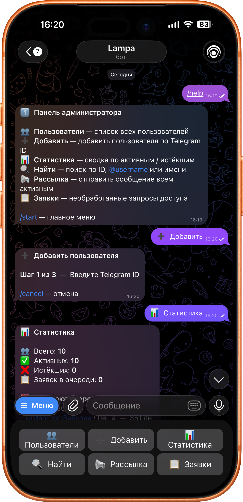

# TelegramBot

[](LICENSE)
[](https://github.com/lampac-nextgen/lampac)
[](https://github.com/lampac-nextgen/lampac)
[](https://github.com/TelegramBots/Telegram.Bot)

> Плагин-модуль для [Lampac NextGen](https://github.com/lampac-nextgen/lampac) — Telegram-бот для управления доступом пользователей: заявки на подключение, одобрение/отклонение админом, выдача и продление токенов, блокировки, рассылки, аудит-лог. Работает поверх собственного `users.json` формата Lampac, никакой отдельной базы данных не требует.

<p align="center">
  
</p>

---

## Содержание

- **[Возможности](#возможности)**
- **[Требования](#требования)**
- **[Установка](#установка)**
- **[Конфигурация](#конфигурация)**
  - [Поля конфигурации](#поля-конфигурации)
- **[Как это устроено](#как-это-устроено)**
  - [Путь пользователя](#путь-пользователя)
  - [Меню и команды](#меню-и-команды)
  - [Карточка пользователя](#карточка-пользователя)
- **[Хранилище данных](#хранилище-данных)**
- **[Безопасность и надёжность](#безопасность-и-надёжность)**
- **[Разработка](#разработка)**
  - [Архитектура](#архитектура)
  - [Локальная сборка](#локальная-сборка)
  - [Известные ограничения](#известные-ограничения)
- **[Лицензия](#лицензия)**

---

## Возможности

| | |
|---|---|
| **Самообслуживание заявок** | Новый пользователь жмёт «Запросить доступ» → заявка уходит админу → одобрение/отклонение в один тап |
| **Токены Lampac** | 9-значный numeric ID генерируется автоматически, с проверкой на коллизию с уже существующими |
| **Гибкое продление** | Пресеты +30 / +90 / +365 дней или произвольная дата — как точечно, так и массово для всех активных сразу |
| **Управление флагами Lampac** | Переключатели `18+` и `Lampac-админ` (`LampacUserParams.Adult/Admin`) прямо из карточки пользователя |
| **Блокировка без потери токена** | «Блокировка» — это откат `expires` в прошлое, а не удаление записи: разблокировка не выдаёт новый ID |
| **Поиск** | По Telegram ID, `@username` или части имени |
| **Рассылка** | Всем активным пользователям, с предпросмотром перед отправкой и троттлингом, чтобы не словить лимиты Telegram |
| **Ежедневные уведомления** | Раз в сутки — пользователям, у кого истекает доступ, и сводка админу; порог настраивается |
| **Аудит-лог из чата** | Последние действия (одобрения, блокировки, продления, смены флагов) — без захода на сервер |
| **Поддержка** | Обычные пользователи пишут в бота — сообщение и кнопка «Ответить» уходят админу |

---

## Требования

> [!IMPORTANT]
> Модуль сам по себе ничего не проверяет со стороны Lampac — он ведёт **отдельный** список пользователей в `users.json` и управляет только доступом к Lampac-аккаунтам (полю `id`/токену). Он не подменяет и не требует `accsdb` — это независимый механизм авторизации.

- Работающий сервер **Lampac NextGen**
- Токен Telegram-бота — получить у [@BotFather](https://t.me/BotFather) (`/newbot`)
- Свой Telegram `admin_id` — числовой ID, узнать можно у [@userinfobot](https://t.me/userinfobot)

---

## Установка

> [!NOTE]
> Lampac NextGen использует **Roslyn** — `.cs`-файлы компилируются сервером на лету. Отдельная сборка DLL для продакшена не нужна, `Telegram.Bot.dll` уже лежит в `references/` этого репозитория.

**1.** Скопируйте содержимое репозитория в `mods/` рядом с исполняемым файлом Lampac:

```
mods/
└── TelegramBot/
    ├── manifest.json
    ├── modInit.cs
    ├── models/
    │   ├── lampacUser.cs
    │   └── telegramBotConf.cs
    ├── services/
    │   ├── auditlog.cs
    │   ├── botsession.cs
    │   ├── pendingrepo.cs
    │   ├── telegrambothostedservice.cs
    │   └── usersrepository.cs
    └── references/
        └── telegram.bot.dll
```

<details>
<summary><b>Скрипт установки/обновления для Linux</b></summary>

<br>

Клонирует репозиторий во временную папку, копирует только нужные файлы модуля и перезапускает сервис:

```bash
LAMPAC_DIR="/opt/lampac"     # ← поменяй под свой путь
TMP_DIR=$(mktemp -d)

git clone --depth 1 https://github.com/badbadtrip/lampa-nextgen-tg-bot.git "$TMP_DIR"

mkdir -p "$LAMPAC_DIR/mods/TelegramBot"
rsync -a --delete \
  --exclude='.git' \
  --exclude='README.md' \
  --exclude='LICENSE' \
  --exclude='CLAUDE.md' \
  --exclude='TelegramBot.csproj' \
  --exclude='screenshots' \
  "$TMP_DIR"/ "$LAMPAC_DIR/mods/TelegramBot/"

rm -rf "$TMP_DIR"

sudo systemctl restart lampac
journalctl -u lampac -f
```

> [!TIP]
> Если команды выполняются через `sudo`/из-под `root`, а сам `lampac.service` крутится под отдельным пользователем — сервис не сможет прочитать только что скопированные файлы (`UnauthorizedAccessException` в логе). Проверь и поправь владельца при необходимости:
> ```bash
> systemctl show lampac -p User --value      # под кем реально работает сервис
> chown -R <user>:<user> "$LAMPAC_DIR/mods/TelegramBot"
> ```

</details>

**2.** Заполните секцию `TelegramBot` в `init.conf` (см. [Конфигурация](#конфигурация)) и перезапустите сервер.

> [!WARNING]
> `bot_token` — секрет. Не публикуйте и не коммитьте его. Если токен утёк — немедленно перевыпустите через BotFather (`/token` → Revoke).

<details>
<summary><b>Обновление Telegram.Bot.dll на более новую версию</b></summary>

<br>

DLL в `references/` можно заменить, если нужна другая версия пакета:

```
nuget install Telegram.Bot -Version 22.4.4 -OutputDirectory ./nuget_tmp
```

Файл окажется в `nuget_tmp/Telegram.Bot.22.4.4/lib/net8.0/Telegram.Bot.dll` — либо соберите через [прилагаемый `.csproj`](#локальная-сборка), который копирует DLL в `references/` автоматически.

</details>

<details>
<summary><b>Отключение модуля</b></summary>

<br>

Два независимых способа:

| Способ | Где | Эффект |
|---|---|---|
| `enable=false` в `init.conf` | секция `TelegramBot` | бот не запускается, но модуль загружается |
| `"enable": false` в `manifest.json` | файл в папке модуля | хост вообще не загружает модуль (требует перезапуска сервера) |

</details>

---

## Конфигурация

Параметры задаются в секции `TelegramBot` файла `init.conf`:

```json
"TelegramBot": {
  "enable": true,
  "bot_token": "123456:ABC-DEF...",
  "admin_id": 123456789,
  "users_file_path": "users.json",
  "default_expire_days": 365,
  "notify_before_days": 7
}
```

### Поля конфигурации

| Поле | Тип | По умолчанию | Описание |
|---|---|---|---|
| `enable` | `bool` | `true` | Выключает модуль целиком без удаления файлов |
| `bot_token` | `string` | `""` | Токен от [@BotFather](https://t.me/BotFather) |
| `admin_id` | `long` | `0` | Telegram ID единственного администратора |
| `users_file_path` | `string` | `"users.json"` | Путь к файлу пользователей Lampac — **тот же файл**, что использует сам Lampac для авторизации |
| `default_expire_days` | `int` | `365` | Срок доступа при одобрении заявки / добавлении вручную / разблокировке |
| `notify_before_days` | `int` | `7` | За сколько дней до истечения слать напоминание пользователю и сводку админу |

> [!NOTE]
> Если `enable=true`, но `bot_token` или `admin_id` не заданы — модуль пишет предупреждение в консоль сервера и не поднимает бота, без падения всего процесса.

---

## Как это устроено

### Путь пользователя

```
Новый пользователь → /start → «🚀 Запросить доступ»
        │
        ▼
Заявка админу (👤 имя, 🕐 время) → ✅ Одобрить / ❌ Отклонить
        │
        ├── ✅ Одобрено → пользователь получает 🔑 токен + срок действия
        │                  (тот же токен можно перевыпустить самому — «🔄 Обновить ID»)
        │
        └── ❌ Отклонено → пользователь получает уведомление об отказе

Доступ истёк → /start → «🔄 Запросить продление» → та же очередь заявок админу
```

Повторные заявки блокируются, пока предыдущая не обработана, плюс на кнопку «Запросить доступ» действует кулдаун **5 минут** на пользователя.

### Меню и команды

Команды: `/start` — главное меню, `/help` — краткая справка, `/cancel` — отменить текущий ввод (работает на любом шаге многошаговых сценариев).

<details>
<summary><b>Меню администратора</b></summary>

<br>

| Кнопка | Действие |
|---|---|
| 👥 Пользователи | Постраничный список, фильтр **Все / Активные / Истёкшие** |
| ➕ Добавить | Ручное добавление по Telegram ID (3 шага: ID → имя → подтверждение) |
| 📊 Статистика | Всего / активных / истёкших, топ-3 ближайших к истечению, заявок в очереди |
| 🔍 Найти | Поиск по Telegram ID, `@username` или части имени |
| 📢 Рассылка | Текст → предпросмотр с числом получателей → подтверждение |
| 📥 Заявки | Необработанные заявки на доступ с одобрением/отклонением прямо из списка |
| 🔁 Продлить всех | Массовое продление всех активных на +30 / +90 / +365 дней |
| 🧾 Аудит | Последние 20 записей `audit.log` прямо в чате |

</details>

<details>
<summary><b>Меню пользователя</b></summary>

<br>

| Кнопка | Действие |
|---|---|
| 📋 Мой профиль | Статус доступа, дата истечения, токен для подключения, кнопка «Обновить ID» |
| 🆘 Поддержка | Свободный текст уходит админу с кнопкой быстрого ответа |

</details>

### Карточка пользователя

Открывается по тапу на пользователя в списке/поиске/заявке:

```
┌  Имя пользователя
│  👤  TG:  123456789
│  🔞  18+   👑  Lampac-админ      ← только если хотя бы один флаг включён
│  🔑  987654321
│  📅  до  01.01.2027
│  ✅  Активен · 128 дн.
└─────────────────
```

Кнопки: 🔒 Заблокировать / 🔓 Разблокировать, 📅 Продлить (пресеты дней или своя дата), 🗑 Удалить (с подтверждением), 🔞 переключить 18+, 👑 переключить Lampac-админ, ‹ Назад к списку.

---

## Хранилище данных

Никакой БД — всё в JSON/текстовых файлах рядом с `users_file_path`. Все файлы, кроме `users.json`, создаются автоматически при первом запуске.

<details>
<summary><b>Все файлы и их формат</b></summary>

<br>

| Файл | Что хранит |
|---|---|
| `users.json` | Основной файл Lampac — `id` (токен), `tg_id`, `group`, `expires` (`yyyy-MM-ddT00:00:00+03:00`), `comment`, `params.adult`, `params.admin` |
| `pending.json` | Заявки на доступ, ожидающие решения админа — переживают перезапуск сервера |
| `notifications_date.txt` | Дата последнего запуска ежедневной проверки истекающих — не даёт слать уведомления чаще раза в сутки |
| `audit.log` | Текстовый журнал: `дата  действие  tg=id  "комментарий"  детали` — одобрения, блокировки, продления, смены токена/флагов |

```json
// users.json — формат записи
{
  "id": "987654321",
  "tg_id": 123456789,
  "group": 1,
  "expires": "2027-01-01T00:00:00+03:00",
  "comment": "@ivanov / Иван",
  "params": { "adult": false, "admin": false }
}
```

</details>

---

## Безопасность и надёжность

> [!NOTE]
> Ниже — то, что уже реализовано в коде, а не просто пожелания.

- **HTML-экранирование.** Имя и `@username` из Telegram-профиля — данные, которые может подставить кто угодно, включая заявки от посторонних. Перед вставкой в сообщения с `ParseMode.Html` они прогоняются через `WebUtility.HtmlEncode`, чтобы нельзя было сломать разметку или подсунуть фейковую ссылку в админ-панель.
- **Атомарные операции с `users.json`.** Блокировка/разблокировка/продление/смена токена идут через единый `Mutate()` с одной блокировкой на весь цикл чтение-изменение-запись — исключает потерю данных при одновременных действиях (админ + пользователь одновременно, или совпадение с часовой проверкой уведомлений).
- **Уникальность токена.** Новый 9-значный ID при выдаче и перевыпуске проверяется на коллизию с уже существующими записями.
- **Троттлинг рассылки.** Между сообщениями пауза ~35 мс — держит поток заявок в пределах лимита Telegram (~30 msg/s), не роняя рассылку на 429.
- **Rate-limit на заявки.** Кулдаун 5 минут на повторное нажатие «Запросить доступ» с одного Telegram ID.

---

## Разработка

<details>
<summary><b>Архитектура</b></summary>

<br>

```
TelegramBot/
├── manifest.json                     # Метаданные модуля для Lampac (enable/dynamic)
├── modInit.cs                        # IModuleLoaded/IModuleConfigure — точка входа, синк конфига
├── models/
│   ├── lampacUser.cs                 # Модель users.json + генератор токена
│   └── telegramBotConf.cs            # Конфигурация модуля
└── services/
    ├── telegrambothostedservice.cs   # BackgroundService: long polling + часовой таймер уведомлений
    ├── botsession.cs                 # Весь диалоговый движок — один класс-диспетчер
    ├── usersrepository.cs            # Чтение/запись users.json, атомарные Mutate-операции
    ├── pendingrepo.cs                # Очередь заявок, диск + in-memory кэш
    └── auditlog.cs                   # Аппенд-only текстовый журнал действий
```

**`telegrambothostedservice.cs`** — снимает вебхук, включает **long polling** (`GetUpdates`), параллельно крутит таймер, который раз в час дёргает проверку уведомлений (сама проверка самоограничивается одним запуском в сутки).

**`botsession.cs`** — вся логика в одном классе-диспетчере. Состояние многошаговых сценариев (мастер добавления, поиск, рассылка) — `Dictionary<long, string>` в памяти, не переживает рестарт сервера. Callback-данные короткие (Telegram режет `callback_data` на 64 байта) — многополевые данные передаются через состояние, а не через сам callback.

**`usersrepository.cs`** — никакого кэша, каждое чтение/запись — целиком файл. Атомарность обеспечивает `Mutate(Action<List<LampacUser>>)` — один `lock` на весь цикл чтение → изменение → запись.

</details>

<details>
<summary><b>Локальная сборка</b></summary>

<br>

Прилагаемый `TelegramBot.csproj` — для IDE/линтинга/CI, не для продакшена (сам Lampac его не использует, см. [Установка](#установка)):

```
dotnet build TelegramBot.csproj
```

Требует .NET 10 SDK. Тянет пакет `Telegram.Bot` и копирует DLL в `references/` автоматически после сборки — обновляет уже закоммиченный файл при смене версии пакета.

</details>

<details>
<summary><b>Известные ограничения</b></summary>

<br>

- **Один администратор.** `admin_id` — единственное значение в конфиге, без списка/ролей.
- **Состояние диалогов не переживает рестарт.** Если сервер перезапустить посреди мастера добавления пользователя или рассылки — прогресс шага теряется, придётся начать заново.
- **Backlog апдейтов реплеится после простоя.** `dropPendingUpdates: false` — осознанный выбор в пользу «не терять сообщения», а не баг; при долгом даунтайме бот обработает все накопленные апдейты при старте.

</details>

---

## Лицензия

[MIT](LICENSE)
